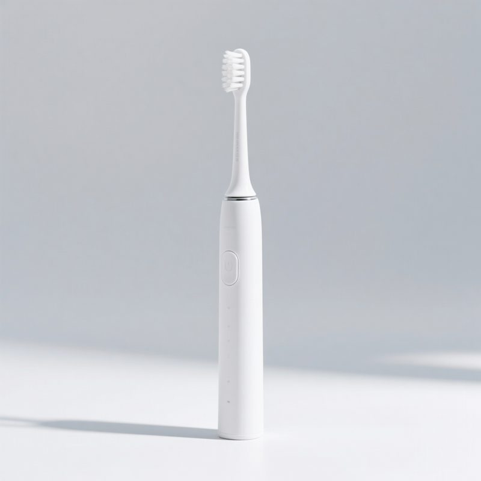

# 🧰 Hermes Skills · 实用技能包 / Practical Skill Pack

> **中文**：开箱即用的 Hermes/Agent 技能集——复制目录即可安装，全部免费开源。
> **English**: Ready-to-use Hermes/Agent skills — copy the folder to install, 100% free & open source.

[](https://opensource.org/licenses/MIT)
[](https://hermes-agent.nousresearch.com)
[](https://agentskills.io)
[](https://github.com/jiawood2006/hermes-skills/pulls)

---

## 🎯 解决什么问题 / What problems does this solve?

| 痛点 / Pain point | 方案 / Solution | 技能 / Skill |
|:---|:---|:---|
| 😩 抖音/视频里的话想转成文字？ | 一键提取视频文案（支持链接+本地） | **video-to-text** |
| 🤖 AI 写的东西一股"机器味"？ | 一键去 AI 味，恢复真人表达 | **de-ai-writer** |
| 📄 PDF/扫描件要抠文字？ | 本地 OCR，隐私安全 | **doc-ocr** |
| 🛒 电商主图/详情图要批量做？ | 素材工坊：场景图+卖点合成一条龙 | **ecommerce-material-studio** |
| 🏗️ 工程项目资料太多理不清？ | 微信对话式 AI 工程顾问（记忆图谱+多群） | **ai-project-advisor** |

---

## 📦 技能清单 / Skill List

### 1️⃣ video-to-text · 视频转文字
- **中文**：输入抖音分享链接或本地视频 → 自动下载 → 提取文字稿
- **English**: Paste a Douyin link or local video → auto-download → extract transcript
- **适用**：短视频文案采集、素材整理、内容二创

### 2️⃣ de-ai-writer · AI 文案去味
- **中文**：把 AI 生成的文字改成自然的人类表达，去掉"首先/其次/总而言之"
- **English**: Rewrite AI-generated text into natural human tone — no more "Firstly/Moreover/In conclusion"
- **适用**：公众号、小红书、产品文案润色

### 3️⃣ doc-ocr · 文档 OCR
- **中文**：PDF/扫描件/图片文字识别，本地处理不上传
- **English**: OCR for PDFs/scans/images — fully local, private & secure
- **适用**：合同扫描、票据存档、纸质资料数字化

### 4️⃣ ecommerce-material-studio · 电商素材工坊
- **中文**：电商主图/详情图/场景图批量生成，产品比例计算+品牌叠加
- **English**: Batch e-commerce images (main/detail/scene), auto product-scale + brand overlay
- **适用**：淘宝/拼多多/快手商家素材生产

### 5️⃣ ai-project-advisor · AI 工程顾问
- **中文**：微信/企微对话式工程项目顾问——记录项目事实、盯关键节点、提醒风险
- **English**: WeChat/WeCom conversational engineering project advisor — records facts, tracks milestones, alerts risks
- **适用**：工程公司老板/项目经理的项目管理助手

---

## 🚀 安装 / Installation

```bash
# 方式一：hermes skills 命令（推荐）
hermes skills install jiawood2006/hermes-skills/skills/video-to-text
hermes skills install jiawood2006/hermes-skills/skills/de-ai-writer
hermes skills install jiawood2006/hermes-skills/skills/doc-ocr
hermes skills install jiawood2006/hermes-skills/skills/ecommerce-material-studio
hermes skills install jiawood2006/hermes-skills/skills/ai-project-advisor

# 方式二：复制目录（任意 Agent 都可用）
cp -r skills/* ~/.hermes/skills/
```

> 💡 兼容 agentskills.io 开放标准——其他支持 Skills 的 Agent 也能用。

---

## 🖼️ 效果示例 / Demo

### 🛒 电商素材工坊：白底图 → 使用场景图

| 输入：产品白底图 / Input | 输出：场景合成图 / Output |
|:---:|:---:|
|  |  |

*一键把白底产品图放进真实使用场景（演示图为 AI 生成的无品牌通用产品）*
*One-click scene composition from a plain product photo (demo shows an AI-generated unbranded product)*

### ✍️ de-ai-writer：去 AI 味前后对比

| 之前（AI 味）/ Before | 之后（真人感）/ After |
|:---|:---|
| 首先，这款产品具有非常出色的性能表现。其次，它的外观设计也非常时尚。总而言之，它是一款值得推荐的产品。 | 这机器上手就俩字：顺手。性能不拖后腿，长得也拿得出手，用过的都懂。 |

*去掉"首先/其次/总而言之"，恢复真人说话的样子*
*Removes "firstly / moreover / in conclusion" — sounds like a human again*

---

## 💬 欢迎反馈 / Feedback

**用了有意见、有问题、有想法？欢迎提出来，每条都会认真看！**
**Used it and have feedback, questions, or ideas? Please share — every issue is read!**

- 🐛 发现 Bug / Found a bug → [提 Issue / Open an Issue](https://github.com/jiawood2006/hermes-skills/issues/new?template=bug_report.md)
- 💡 想要新技能 / Want a new skill → [求新技能 / Request a skill](https://github.com/jiawood2006/hermes-skills/issues/new?template=feature_request.md)
- 💬 随便聊聊 / Just chat → [Discussions](https://github.com/jiawood2006/hermes-skills/discussions)

*你的意见能让这些技能更好用——尤其是"哪里不好用"的吐槽最宝贵。*
*Your feedback makes these skills better — especially "what doesn't work well".*

---

## ⭐ 支持作者 / Support

**好用请点 Star ⭐——你的支持是开源的动力！**
**If you find this useful, please Star ⭐ — it keeps the project alive!**

- 免费使用，无需任何费用 / Free to use
- 欢迎 PR / Issues / 建议 / PRs, Issues & feedback welcome
- 想支持更多：扫码或联系（详见各技能内 SKILL.md）/ Scan QR or contact (see SKILL.md inside each skill)

---

## 📄 License

MIT — 自由使用，保留版权声明即可 / Free to use with attribution.
